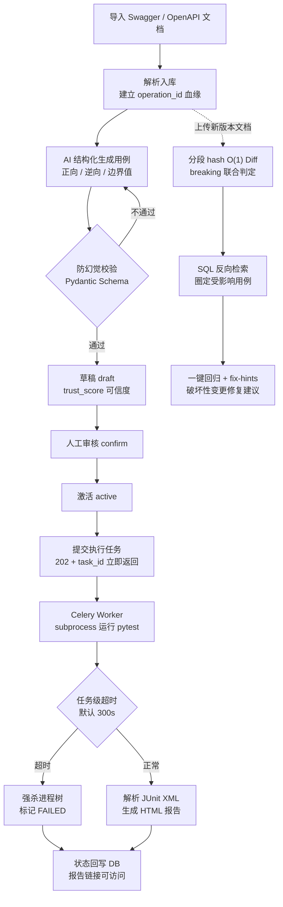
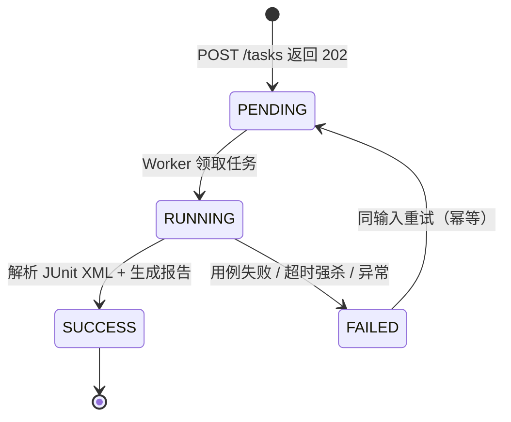

<div align="center">
  <h1>智能化接口测试效能平台 · 后端</h1>

  <p>
    <a href="https://github.com/Testamentt/ApiTestPlatform_Backend/actions/workflows/ci.yml"></a>
    
    
    
    
    
    
    
    
  </p>

  <p>
    <strong>AI 提效 + 异步解耦 + 精准回归</strong> ——<br>
    让用例编写从「重复劳动」变为「审核确认」，让回归范围从「经验猜测」变为「血缘圈定」，让执行从「阻塞卡死」变为「异步兜底」。
  </p>
</div>

## 项目描述

基于 FastAPI + Celery + AI 的接口测试效能平台后端，打通「用例智能生成 → 变更影响圈定 → 异步执行 → 报告输出」完整测试闭环。配套 Vue 3 前端独立仓库：[ApiTestPlatform_Frontend](https://github.com/Testamentt/ApiTestPlatform_Frontend)。

## 项目预览

<!-- TODO: 补充截图（docs/images/）：Swagger UI 生成链路一张 + 任务执行 / HTML 报告一张，或录一张 GIF -->

暂无截图。后端自带 **Swagger UI 交互界面**（`/docs`，带 Authorize 鉴权按钮），任务执行产出**自包含 HTML 报告**；配套前端四页（仪表盘 / 用例管理 / 任务执行 / AI 生成）见前端仓库。

## 核心功能

| 接口测试痛点 | 平台方案 | 量化效果 |
| :--- | :--- | :--- |
| 用例编写重复耗时 | AI 解析 OpenAPI 结构化生成 + 人工审核兜底 | 10~15 min/接口 → 2~3 min/接口 |
| 变更后回归范围凭经验 | operation_id 血缘 + Diff 自动圈定 | 1~2 h 人工分析 → <10 s 自动圈定 |
| 同步执行阻塞卡死 | Celery 异步解耦 + 任务级超时兜底 | Web 响应稳定 <50 ms，死循环不卡系统 |

### 🧠 AI 用例智能生成

> 针对单接口覆盖正向 / 逆向 / 边界值 / 异常场景手写重复性高的痛点，设计「OpenAPI 解析 → 结构化 Prompt → LLM 生成 → 人工审核」链路，单接口用例编写 10~15 min → 2~3 min（耗时降低约 80%），LLM 只产草稿，人始终是最后一道闸。

- **自研 OpenAPI 3.0 解析器** — 不依赖第三方 SDK，容错 + 递归深度限制，320 paths / 338 operations 实测 0 warning 入库。
- **结构化 Prompt** — 正向 / 逆向 / 边界值三类用例模板，prompt 层强约束每条用例至少 1 条断言。
- **三层防幻觉护栏** — LLM 输出过 Pydantic Schema 严格校验 → 状态恒为 `draft` 禁止自动激活 → `operation_id` 服务端注入；`trust_score` 记录血缘可信度。
- **成本可控** — `llm_client` 唯一封装：输入长度预检、连接/读超时、指数退避重试，每次生成落 token 与成本审计（实测单次全流程 ≈ $0.003）。

### 🎯 接口变更影响圈定

> 针对接口变更后回归范围凭经验判断、漏测风险高的痛点，设计「operation_id 血缘 + 分段 hash Diff + SQL 反向检索」纯规则链路（无 LLM、零成本、无幻觉），影响圈定 1~2 h 人工分析 → <10 s 自动完成。

- **operation_id 静态血缘** — 用例与接口定义建立可反查关联，是影响分析的地基。
- **分段 hash O(1) Diff** — 上传新版 Swagger 与历史快照比对，变更点秒级定位，breaking 联合判定破坏性等级。
- **SQL 反向检索** — 破坏性变更自动圈定受影响用例，附孤儿用例迁移清单。
- **一键回归 + fix-hints** — 圈定结果直接发起回归，破坏性变更给出 AI 修复建议。

### ⚡ 异步执行引擎

> 针对同步调 pytest 长耗时阻塞 Web 的痛点（同步超时率 30%+），设计「Celery 异步解耦 + 任务级超时强杀 + 幂等重试」，Web 服务 ≠ 执行引擎，响应稳定 <50 ms，死循环不卡系统。

- **Celery + Redis 任务队列** — `POST /tasks` 立即返回 `task_id`（202），前端轮询至终态，Web 进程零阻塞。
- **任务级超时兜底** — 默认 300 s 强杀 pytest 进程树，`scan_stale_tasks` 从 DB 读 pid 权威兜底，防死循环卡死系统。
- **Lookup-Create 幂等** — `run_id` 去重：SUCCESS 复用结果，FAILED 同输入可重试。
- **HTML 报告** — 自包含单文件，字段转义防 XSS，`/static/{task_id}/report.html` 按任务隔离访问。

### 🏭 质量门禁与工程化

> 用测试平台的标准来测这个测试平台：CI 三 job 门禁 + 全链路追踪 + 工程红线，让每个量化数字都有门禁背书。

- **CI 三 job 门禁** — ruff 静态检查 + pytest（覆盖率全局 ≥60% / 核心模块 ≥80%，实测 91%）+ Docker 镜像构建验证。
- **Bearer Token 鉴权** — HTTPBearer 统一依赖注入（无凭证 401 / 凭证错误 403），`/health` 免鉴权作探针，`/docs` 生产可关。
- **全链路追踪** — `X-Request-ID` 从 Web → Celery → LLM 日志贯穿同一请求 id，问题可定位。
- **LLM 治理红线** — 唯一封装 `llm_client` 禁止业务代码裸调 SDK、输出必过 Schema 校验、生成恒为 `draft`、密钥只放 `.env`、测试必 mock LLM。
- **工程红线** — 注释只写为什么、禁止吞异常、外部调用必设 timeout（值来自 config）、SQLite 强制 WAL + busy_timeout + foreign_keys。

## 系统流程

### 主流程（活动图）



### 任务状态机（状态图）



## 技术栈

| 层次 | 技术 | 作用 |
| :--- | :--- | :--- |
| Web 服务层 | Python 3.12、FastAPI、SQLAlchemy 2.0、Pydantic Settings | REST API、六表数据访问与类型安全配置 |
| 数据存储 | SQLite（WAL + busy_timeout + foreign_keys）、Redis | 业务数据单一事实源；Celery Broker 与状态缓存 |
| 异步执行层 | Celery 5、subprocess + pytest | 任务解耦、进程隔离执行、超时强杀、报告生成 |
| AI 能力层 | DeepSeek API（OpenAI 兼容）、自研 OpenAPI 3.0 解析器、结构化 Prompt | 用例智能生成、三层防幻觉护栏与成本审计 |
| 质量与交付 | pytest、ruff、GitHub Actions、Docker Compose | 测试门禁、静态检查、CI 三 job、一键容器化 |
| 配套前端 | Vue 3、Element Plus、Pinia、Vite、Vitest | 四页管理界面与 41 个单测（独立仓库，见文首链接） |

## 快速开始

### 环境要求

| 组件 | 版本 | 说明 |
| :--- | :--- | :--- |
| Python | 3.12+ | 后端运行环境 |
| Redis | 任意可用版本 | 本地 127.0.0.1:6379，需设置 requirepass |
| Docker Desktop | 可选 | 一键容器化演示，免装 Python / Redis |
| DeepSeek API Key | 可选 | 仅 AI 用例生成功能需要，配置在 `.env` |

### 常见命令

| 命令 | 作用 |
| :--- | :--- |
| `pytest -q` | 后端测试门禁（单元 / 接口 / 任务） |
| `ruff check .` | 静态检查 |
| `scripts\start_all.bat` | 一键拉起 Web + Worker（两个窗口） |
| `scripts\reset_db.bat` | 重置开发库（schema 漂移时） |
| `python scripts/mock_target.py` | 启动本地被测 mock 服务（:9999） |
| `docker compose up --build` | 容器一键演示（mock + Web + Redis + Worker） |

### 后端启动

```bash
# 1. 安装依赖
python -m venv .venv
.venv\Scripts\activate          # Windows；Linux/macOS 用 source .venv/bin/activate
pip install -e ".[dev]"

# 2. 初始化配置
copy config\settings.example.yaml config\settings.yaml
copy .env.example .env          # 编辑 .env：填入 Redis 密码；AI 生成功能再填 DEEPSEEK_API_KEY

# 3. 启动本地被测 mock 服务（另开终端，保持运行；execution.base_url 默认指向它）
python scripts/mock_target.py   # 监听 127.0.0.1:9999

# 4. 启动 Web 服务
uvicorn app.main:app --port 8000

# 5. 启动 Celery Worker（Windows 必须 --pool=solo）
celery -A app.celery_app:celery_app worker --pool=solo

# 步骤 4/5 也可用 scripts\start_all.bat 一键拉起
```

启动后验证：

- Swagger UI 界面：`http://127.0.0.1:8000/docs`（右上角 Authorize，token 默认 `testplatform-dev-token`）
- 健康探针：`http://127.0.0.1:8000/health`

免装环境时可用 Docker 一键演示（替代步骤 1~5，内置 mock 服务，全离线可复现）：

```bash
docker compose up --build
```

### 被测系统接入（两种形态，`execution.base_url` 切换）

| 形态 | 说明 | 适用 |
| :--- | :--- | :--- |
| **离线 mock** | `scripts/mock_target.py`（httpbin 兼容子集：`/get`、`/post`、`/status/{code}`、`/delay/{n}`、`/bearer`） | 日常演示——全离线可复现，不依赖外网 |
| **管伊佳ERP**（真实业务系统） | 本机 `:9999/jshERP-boot`；Swagger2 文档经 `scripts/convert_swagger2.py` 转 OpenAPI3 入库（320 paths / 338 operations），执行层自动登录取 token 注入请求头 | 真实业务链路演示（端到端冒烟 4/4 passed） |

真实系统需要登录态时，执行层按 `execution.auth_*` 配置自动适配；凭证只放 `.env`（`ERP_TEST_USERNAME/PASSWORD`），生成的测试文件不含密钥。详见 [docs/execution-engine.md](docs/execution-engine.md)。

### 前端启动

```bash
git clone https://github.com/Testamentt/ApiTestPlatform_Frontend
cd ApiTestPlatform_Frontend     # 需要 Node ≥ 20 + pnpm 10
pnpm install
pnpm dev                        # http://localhost:5173（Vite 代理 /api、/static、/docs 到后端 8000）
```

首次打开在顶栏「令牌」输入 `testplatform-dev-token`，详见前端仓库 [README](https://github.com/Testamentt/ApiTestPlatform_Frontend)。

## 目录结构

```text
ApiTestPlatform_Backend/        # 本仓库（后端）
├── app/
│   ├── api/                    # 路由层（不写业务逻辑）
│   ├── schemas/                # Pydantic 请求 / 响应模型
│   ├── services/               # 业务层（生成 / 执行 / 影响分析）
│   ├── repositories/           # 数据访问层
│   ├── models/                 # SQLAlchemy 六表模型
│   ├── tasks/                  # Celery 异步任务
│   ├── core/                   # 配置加载、数据库连接、异常与日志
│   ├── middleware/             # X-Request-ID 全链路追踪中间件
│   └── utils/                  # llm_client、subprocess 等外部调用唯一封装
├── prompts/v1/                 # 结构化 Prompt（system / user / fix-hints / 边界规则）
├── config/                     # settings.yaml 分段配置（Pydantic Settings）
├── scripts/                    # mock_target / start_all / reset_db 等脚本
├── tests/                      # 单元 / 接口 / 任务 / e2e 测试
├── docs/                       # architecture / api / database 等专题文档
└── docker-compose.yml          # mock + Web + Redis + Worker 一键编排
```

## 常见问题

| 现象 | 处理方式 |
| :--- | :--- |
| `GET /cases` 返回 500 提示缺列 | `create_all` 不 ALTER 旧表导致 schema 漂移：运行 `scripts\reset_db.bat` 重置 dev 库（数据可丢，已 gitignore），或手动 `ALTER TABLE` 补列 |
| Celery Worker 启动报错 | Windows 本地必须加 `--pool=solo`（不支持 prefork 池） |
| 接口返回 401 / 403 | Bearer Token 未配置或错误：Swagger 右上角 Authorize 填 `testplatform-dev-token`，或修改 `.env` 的 `TESTPLATFORM_SECURITY_API_TOKEN` |
| Web 服务连不上 Redis | 确认 127.0.0.1:6379 可达，`.env` 中 `TESTPLATFORM_REDIS_PASSWORD` 与实际 requirepass 一致 |
| AI 生成任务一直排队 / 失败 | 确认 Worker 已启动、`DEEPSEEK_API_KEY` 已填入 `.env`；生成任务软/硬超时为 540/600 s，可按需调整 |
| 执行任务 FAILED | 确认被测服务已启动（`python scripts/mock_target.py`），`execution.base_url` 与之一致；同输入任务可直接重试 |
| 不想装本地环境 | `docker compose up --build` 一键拉起 mock + Web + Redis + Worker，内置默认 token |

## 文档索引

| 文档 | 内容 |
| :--- | :--- |
| [docs/architecture.md](docs/architecture.md) | 双界面、后端三层、进程隔离、异步模型、核心决策 |
| [docs/database.md](docs/database.md) | 数据模型（6 表字段级设计） |
| [docs/api.md](docs/api.md) | REST API 设计（端点总表） |
| [docs/execution-engine.md](docs/execution-engine.md) | Celery 任务、subprocess 执行、超时劫持、被测系统接入、HTML 报告 |
| [docs/ai-generation.md](docs/ai-generation.md) | OpenAPI 解析、Prompt 设计、draft→active 审核流 |
| [docs/impact-analysis.md](docs/impact-analysis.md) | 变更影响分析算法、一键回归、fix-hints |
| [docs/configuration.md](docs/configuration.md) | 配置管理（Pydantic Settings 分段配置） |

## 开源说明

本项目为个人独立开发的技术作品，用于学习交流与面试展示。

- 代码结构与实现思路欢迎参考、交流；如需复用请先提 Issue 沟通。
- 前端仓库：[ApiTestPlatform_Frontend](https://github.com/Testamentt/ApiTestPlatform_Frontend)（Vue 3 四页管理界面）。
